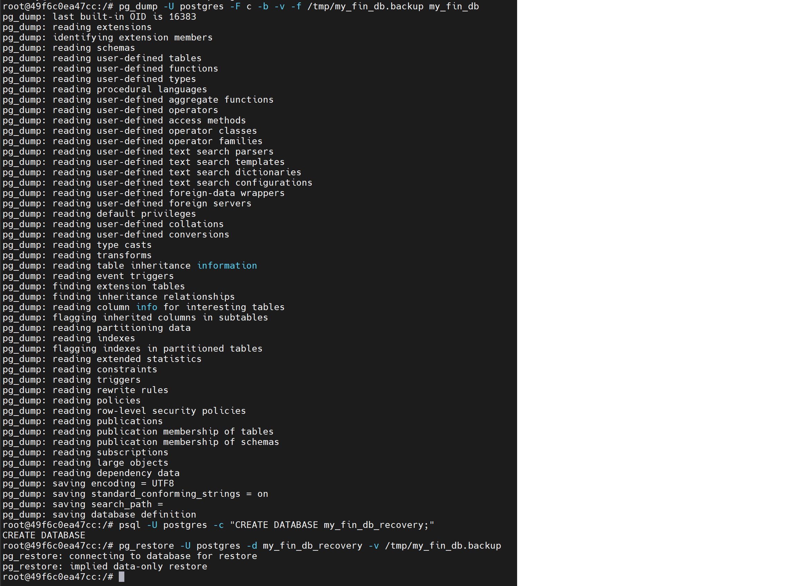
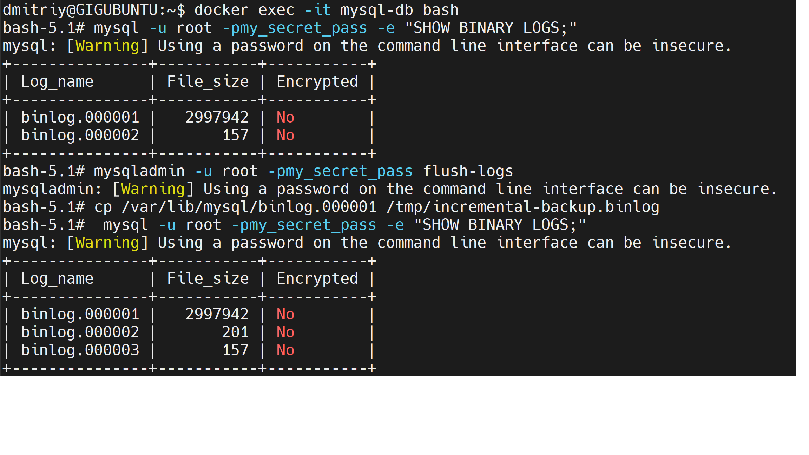

## Задание 1. Резервное копирование
### 1.1. Восстановление данных в полном объёме за предыдущий день
Для этого идеально подходит полное резервное копирование, которое запускается раз в сутки ночью.
Каждую ночь создаётся полный слепок базы данных. Если в среду днём происходит сбой, мы просто разворачиваем бэкап, сделанный в ночь с вторника на среду.
Данные за текущий рабочий день будут потеряны, но условие будет выполнено.

### 1.2. Восстановление данных за час до предполагаемой поломки
Ежедневный полный бэкап + инкрементный бэкап или резервное копирование журналов транзакций/WAL/бинлогов каждый час.
Если база упала в 14:30, мы восстанавливаем полный ночной бэкап, а затем поочерёдно накатываем часовые инкременты за 09:00, 10:00 ... до 14:00. Потеряются данные только за последние 30 минут.

## Задание 2. PostgreSQL
Продемонстрирована работа со штационными утилитами резервного копирования (`pg_dump`) и восстановления (`pg_restore`).
1. **Резервное копирование:** С помощью команды `pg_dump -F c` создан бэкап базы данных `my_fin_db` в кастомном сжатом формате.
2. **Восстановление:** С помощью утилиты `psql` создана чистая база данных `my_fin_db_recovery`, в которую через `pg_restore` успешно развернуты данные из файла бэкапа.

## Задание 3. MySQL
Инкрементное резервное копирование для СУБД MySQL реализовано через механизм бинарных логов, фиксирующих все изменения на сервере.
1. С помощью команды `SHOW BINARY LOGS;` зафиксировано исходное состояние лог-файлов.
2. Команда `mysqladmin flush-logs` принудительно закрыла текущий активный файл изменений (`binlog.000002`), переведя его в статус только для чтения, и открыла новый файл (`binlog.000003`).
3. Зафиксированный файл изменений был безопасно скопирован утилитой `cp` в директорию бэкапов. Повторный вызов списка логов подтверждает успешную ротацию.

